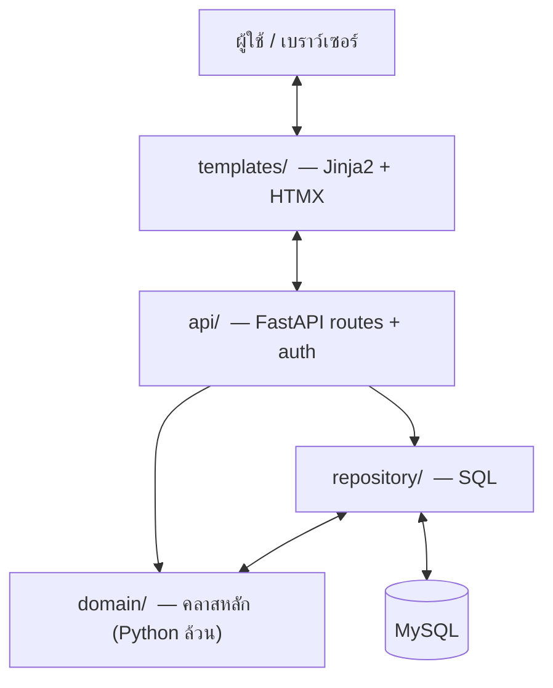
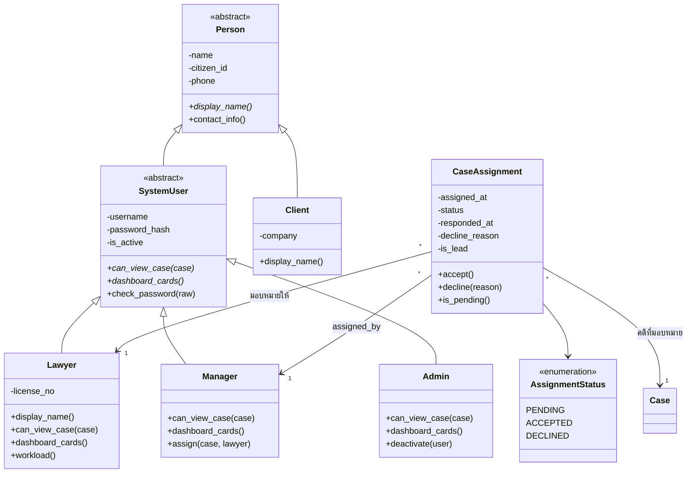
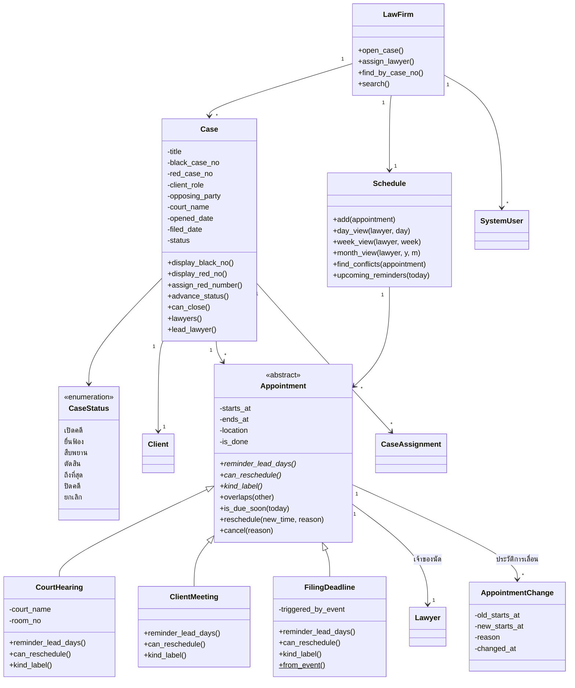
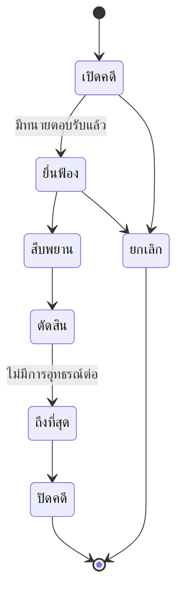
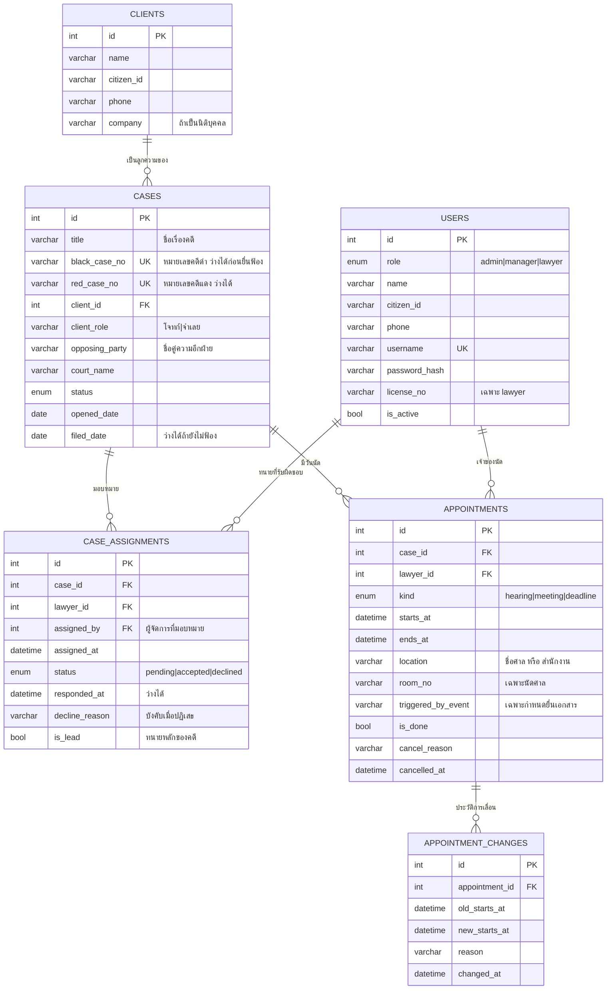

# ข้อเสนอโปรเจกต์ — ระบบผู้ช่วยจัดการคดีและตารางนัดหมายสำหรับสำนักงานกฎหมาย

**Law Firm Case & Schedule Assistant**

| | |
|---|---|
| รายวิชา | Object-Oriented Programming |
| ผู้จัดทำ | นายเมทนี พูลสมบัติ |
| รหัสนักศึกษา | 6821500060 |
| ขนาดทีม | 1 คน |
| วันที่ | กันยายน 2569 |

> **ฉบับแก้เมื่อ 30 สิงหาคม 2569** — เพิ่มบทบาทผู้ใช้ 3 ระดับพร้อมการมอบหมายคดี และตัดประเภทคดีกับส่วนชั่วโมงทำงานและค่าจ้างออกทั้งหมด เพื่อคุมขนาดงานให้จบในเวลาที่มี · รายการงานและขอบเขตงานรายรายการอยู่ที่ [`backlog.md`](backlog.md) · ผังคลาสและผัง ER ฉบับย่ออยู่ที่ [`uml.md`](uml.md)

---

## 1. ที่มาและปัญหา

สำนักงานกฎหมายขนาดเล็กมีทนายไม่กี่คน แต่ถือคดีรวมกันหลายสิบคดี แต่ละคดีมีวันนัดของศาลคนละวัน คนละศาล และมีกำหนดเวลาตามกฎหมายที่พลาดไม่ได้ ทุกวันนี้ทนายส่วนใหญ่จดวันนัดไว้ในสมุด ปฏิทินในโทรศัพท์ และหมายนัดที่ศาลให้มา แยกกันคนละที่ ส่วนผู้จัดการสำนักงานมอบหมายคดีผ่านการบอกปากเปล่าหรือแชต ทำให้เกิดปัญหา 4 อย่าง

1. **นัดชนกันโดยไม่รู้ตัว** — รับนัดใหม่ตอนอยู่ที่ศาล แล้วเพิ่งมารู้ทีหลังว่าวันนั้นมีนัดอีกคดีอยู่แล้ว หรือมีนัดสองศาลคนละจังหวัดในเช้าเดียวกัน
2. **พลาดกำหนดเวลาตามกฎหมาย** — กำหนดยื่นคำให้การ ยื่นอุทธรณ์ หรือยื่นฎีกา นับจากวันที่เกิดเหตุการณ์และพลาดไม่ได้ แต่ไม่มีอะไรนับวันให้
3. **มอบหมายงานแล้วไม่รู้ว่าใครรับหรือไม่รับ** — ผู้จัดการส่งคดีให้ทนายทางแชต ทนายอาจยังไม่เห็น อาจรับไม่ไหว หรือรับไปแล้วแต่ไม่มีใครจดไว้ พอถึงวันนัดจึงเพิ่งรู้ว่าคดีนั้นไม่มีเจ้าของจริง
4. **มอบหมายงานเกินตัว** — ตอนแจกคดีใหม่ไม่เห็นภาพว่าทนายแต่ละคนเดือนหน้ามีนัดแน่นแค่ไหนอยู่แล้ว

ระบบนี้ตั้งใจให้เป็น **เครื่องมือประจำวันของสำนักงาน** เปิดตอนเช้าแล้วทนายเห็นทันทีว่าวันนี้ต้องไปศาลไหน คดีอะไร มีคดีใหม่รอตอบรับไหม และมีอะไรใกล้ครบกำหนด ส่วนผู้จัดการเห็นว่าคดีไหนยังไม่มีคนรับ และใครว่างพอจะรับเพิ่ม

---

## 2. ขอบเขต

**อยู่ในขอบเขต** — เรียงตามความสำคัญ โดยกลุ่มแรกคือแกนของระบบ

*แกนหลัก — เวลาและตารางนัดของทนาย*

- ตารางนัดของทนายรายวัน รายสัปดาห์ และปฏิทินรายเดือน
- บันทึกนัดหมาย 3 ประเภท — นัดศาล / นัดพบลูกความ / กำหนดยื่นเอกสารตามกฎหมาย
- ตรวจนัดชนกันของทนายคนเดียวกัน
- นับวันครบกำหนดตามกฎหมายให้อัตโนมัติจากวันที่เกิดเหตุการณ์
- แจ้งเตือนล่วงหน้าโดยระยะเวลาเตือนต่างกันตามประเภทนัด

*แกนหลัก — บทบาทผู้ใช้และการมอบหมายคดี*

- ผู้ใช้ 3 บทบาท — ผู้ดูแลระบบ / ผู้จัดการสำนักงาน / ทนายความ
- ผู้จัดการมอบหมายคดีให้ทนาย โดยเห็นภาระงานของแต่ละคนประกอบการตัดสินใจ
- ทนายเห็นคดีที่ได้รับมอบหมายบนหน้าแรกของตน และกดรับหรือปฏิเสธพร้อมเหตุผล
- ทนายเห็นเฉพาะคดีที่ตนตอบรับแล้วเท่านั้น

*ส่วนรองรับ*

- ทะเบียนลูกความและผู้ใช้ระบบ
- เปิดคดี บันทึกสถานะ และเดินสถานะตามลำดับกระบวนพิจารณา
- ออกหมายเลขคดีดำเมื่อยื่นฟ้อง และบันทึกหมายเลขคดีแดงเมื่อศาลมีคำพิพากษา
- ค้นหาคดีด้วยหมายเลขคดีดำ / คดีแดง เป็นช่องทางหลัก

**ไม่อยู่ในขอบเขต** (ระบุไว้ชัดเพื่อคุมเวลา)

- **แยกประเภทคดีแพ่ง / อาญา / แรงงาน** — คดีเป็นชนิดเดียว ใช้ชื่อเรื่องคดีบอกแทน จึงไม่มีค่าขึ้นศาลและวันครบอายุความที่คิดต่างกันตามประเภท
- **บันทึกชั่วโมงทำงาน ค่าจ้าง มัดจำ และใบแจ้งหนี้** — ระบบไม่ยุ่งกับเงินเลย
- เชื่อมต่อปฏิทินภายนอก เช่น Google Calendar
- ส่งการแจ้งเตือนออกนอกระบบ ทั้งอีเมล LINE และ SMS — ระบบแจ้งเตือนบนหน้าจอเท่านั้น
- อัปโหลดและจัดเก็บไฟล์เอกสารคดี
- กฎเวลาเดินทางระหว่างสถานที่ — ตรวจเฉพาะเวลาที่ทับกันจริง
- ตารางสิทธิ์ผู้ใช้แบบตั้งค่าได้ตอนใช้งาน — สิทธิ์อยู่ในคลาสของแต่ละบทบาท
- แอปมือถือ

> **หมายเหตุ** ระยะเวลาตามกฎหมายที่ใช้ในระบบเป็นค่าที่ทำให้ง่ายขึ้นเพื่อใช้ประกอบการเรียน ไม่ใช่ค่าตามกฎหมายที่ใช้อ้างอิงได้จริง

---

## 3. ผู้ใช้ระบบ

| บทบาท | ความสำคัญ | ทำอะไรได้ |
|---|---|---|
| **ทนายความ** (`lawyer`) | ผู้ใช้หลัก ออกแบบระบบโดยยึดคนกลุ่มนี้เป็นศูนย์กลาง | ดูตารางนัดและปฏิทินของตน, รับหรือปฏิเสธคดีที่ได้รับมอบหมาย, บันทึกและเลื่อนนัด, ดูรายการใกล้ครบกำหนด, ดูคดีที่ตนตอบรับแล้ว |
| **ผู้จัดการสำนักงาน** (`manager`) | ผู้กระจายงาน | เปิดคดี, มอบหมายคดีให้ทนายโดยดูภาระงานประกอบ, เห็นคดีที่ยังไม่มีคนรับและคดีที่ถูกปฏิเสธพร้อมเหตุผล, เห็นทุกคดีในสำนักงาน |
| **ผู้ดูแลระบบ** (`admin`) | ดูแลงานระบบ ไม่ยุ่งกับเนื้อหาคดี | เพิ่มและปิดการใช้งานผู้ใช้, ตั้งบทบาท, รีเซ็ตรหัสผ่าน — **เปิดหน้าคดีไม่ได้** |

ลูกความไม่ใช่ผู้ใช้ระบบ เป็นเพียงข้อมูลในทะเบียน จึงไม่มีบัญชีเข้าใช้งาน

### เรื่องเล่าประจำวัน

> **ผู้จัดการ 08:30** เปิดระบบ หน้าแรกบอกว่ามีคดีใหม่ 2 คดีที่ยังไม่มีทนายรับ และคดี `ผิดสัญญาซื้อขาย` ถูกปฏิเสธเมื่อวาน เหตุผลว่า "ติดนัดสืบพยานคดีอื่นทั้งสัปดาห์นั้น"
> กดเข้าหน้ามอบหมาย เห็นรายชื่อทนายเรียงจากคนที่ภาระงานน้อยที่สุด เลือกทนายคนที่ถือ 4 คดี แล้วมอบหมายให้
>
> **ทนาย 09:00** เปิดระบบ หน้าแรกคือตารางวันนี้ — นัดสืบพยาน 09:00 ที่ศาลแพ่ง คดี `1234/2568` และนัดพบลูกความ 14:00 ที่สำนักงาน
> ด้านบนมีกล่องขึ้นว่ามีคดีใหม่รอการตอบรับ 1 คดี กดดูรายละเอียดคร่าว ๆ แล้วกด **รับคดี** คดีนั้นขึ้นในรายการคดีของตนทันที
> ด้านข้างขึ้นเตือนสีแดงว่า คดี `88/2568` เหลือเวลายื่นอุทธรณ์อีก 6 วัน
>
> **ทนาย 16:00** ศาลนัดสืบพยานคดีอื่นเพิ่มในวันที่ 20 เวลา 09:00 พอบันทึกเข้าไป ระบบทักว่าวันนั้นมีนัดที่ศาลจังหวัดนนทบุรีเวลา 09:30 อยู่แล้ว เวลาทับกัน
>
> **ทนาย 17:30** เปิดปฏิทินเดือนหน้า เห็นว่าสัปดาห์ที่สามมีนัดศาล 5 นัด จึงรู้ล่วงหน้าว่าถ้ามีคดีใหม่เข้ามาช่วงนั้นควรปฏิเสธ

---

## 4. ความต้องการของระบบ

แบ่งเป็น 4 กลุ่ม โดยกลุ่ม A, B และ F เป็นแกนของระบบ ส่วน C และ D เป็นส่วนรองรับ

> **หมายเลขที่เลิกใช้แล้ว** — FR-D1 (แยกประเภทคดี), FR-C1 ถึง FR-C3 (บันทึกชั่วโมงทำงาน) และ FR-E ทั้งกลุ่ม (ค่าจ้างและใบแจ้งหนี้) ตัดออกเมื่อ 30 ส.ค. 2569 · คงหมายเลขที่เหลือไว้เท่าเดิมเพื่อไม่ให้การอ้างอิงใน `backlog.md` และในเทสต์คลาดกัน

### A. ตารางนัดหมาย

| รหัส | ความต้องการ | ผลลัพธ์ที่ผู้ใช้เห็น |
|---|---|---|
| FR-A1 | บันทึกนัดหมายผูกกับคดี ระบุประเภทนัด วันเวลาเริ่ม–สิ้นสุด และสถานที่ | รายการนัดปรากฏบนตารางของทนายที่รับผิดชอบ |
| FR-A2 | ดูตารางนัดของตนเองแบบรายวันและรายสัปดาห์ | หน้าแรกคือตารางวันนี้ เรียงตามเวลา พร้อมหมายเลขคดีของแต่ละนัด |
| FR-A3 | **ตรวจนัดชนกันขณะบันทึก** | ถ้าชนกับนัดเดิม ระบบเตือนพร้อมบอกว่าชนกับนัดใด และไม่บันทึกให้จนกว่าจะแก้ |
| FR-A4 | เลื่อนหรือยกเลิกนัด พร้อมบันทึกเหตุผล | ประวัติการเลื่อนของนัดนั้นเก็บไว้ ดูย้อนหลังได้ว่าเลื่อนมากี่ครั้งเพราะอะไร |
| FR-A5 | ปฏิทินรายเดือนของทนาย | เห็นภาพรวมทั้งเดือนว่าสัปดาห์ไหนแน่น จิ้มวันแล้วไปตารางของวันนั้น |

### B. กำหนดเวลาตามกฎหมาย

| รหัส | ความต้องการ | ผลลัพธ์ที่ผู้ใช้เห็น |
|---|---|---|
| FR-B1 | **นับวันครบกำหนดให้อัตโนมัติจากเหตุการณ์ตั้งต้น** | บันทึกวันที่ศาลอ่านคำพิพากษา ระบบสร้างกำหนดยื่นอุทธรณ์ให้เองโดยไม่ต้องกรอกวันที่ |
| FR-B2 | แจ้งเตือนล่วงหน้า โดยระยะเวลาเตือนต่างกันตามประเภทของรายการ | กำหนดยื่นเอกสารเตือนล่วงหน้านานกว่านัดพบลูกความ เพราะต้องใช้เวลาเตรียม |
| FR-B3 | หน้ารวมรายการที่ใกล้ครบกำหนด เรียงตามความเร่งด่วน | รายการเดียวที่รวมนัดทุกประเภทที่ใกล้ถึงกำหนด |
| FR-B4 | ทำเครื่องหมายว่าดำเนินการแล้ว | รายการที่ทำแล้วหายจากหน้าเตือน แต่ยังอยู่ในประวัติของคดี |

### C. ภาระงานของทนาย

| รหัส | ความต้องการ | ผลลัพธ์ที่ผู้ใช้เห็น |
|---|---|---|
| FR-C4 | ดัชนีภาระงานของทนายแต่ละคน | จำนวนคดีที่ถืออยู่และจำนวนนัดในอีก 30 วัน แสดงในหน้ามอบหมายของผู้จัดการ |
| FR-C5 | เตือนเมื่อมอบหมายให้ทนายที่ภาระงานเกินเกณฑ์ | ระบบเตือน แต่ผู้จัดการยืนยันแล้วมอบหมายต่อได้ |

### D. คดีและการค้นหา

| รหัส | ความต้องการ | ผลลัพธ์ที่ผู้ใช้เห็น |
|---|---|---|
| FR-D2 | บันทึกหมายเลขคดีดำเมื่อยื่นฟ้อง และหมายเลขคดีแดงเมื่อศาลตัดสิน | หมายเลขคดีแสดงคู่กับทุกนัดของคดีนั้น |
| FR-D3 | ค้นหาด้วยหมายเลขคดีเป็นช่องทางหลัก | พิมพ์ `1234/2568` แล้วเข้าหน้าคดีทันที ถ้าพิมพ์เป็นชื่อจึงค้นจากชื่อเรื่องคดี ชื่อคู่ความ และชื่อทนาย |
| FR-D4 | มอบหมายทนายให้คดี | คดีหนึ่งมีทนายรับผิดชอบได้มากกว่า 1 คน และมีทนายหลัก 1 คน |
| FR-D5 | ทะเบียนลูกความ | ค้นหาและดูคดีทั้งหมดของลูกความรายนั้น |

### F. บทบาทผู้ใช้และการมอบหมายคดี

| รหัส | ความต้องการ | ผลลัพธ์ที่ผู้ใช้เห็น |
|---|---|---|
| FR-F1 | เข้าระบบด้วยบัญชีผู้ใช้ และเห็นเฉพาะส่วนที่บทบาทของตนเข้าถึงได้ | ทนายเปิดหน้าของผู้จัดการไม่ได้ ผู้ดูแลระบบเปิดหน้าคดีไม่ได้ |
| FR-F2 | หน้าแรกต่างกันตามบทบาท | ทนายเห็นตารางวันนี้ ผู้จัดการเห็นคดีที่รอมอบหมาย ผู้ดูแลระบบเห็นรายชื่อผู้ใช้ |
| FR-F3 | **ผู้จัดการมอบหมายคดีให้ทนาย** โดยเห็นภาระงานของแต่ละคนก่อนตัดสินใจ | เลือกคดี เห็นรายชื่อทนายเรียงจากคนที่ว่างที่สุด แล้วกดมอบหมาย |
| FR-F4 | **ทนายกดรับหรือปฏิเสธคดีที่ได้รับมอบหมาย** พร้อมเหตุผลเมื่อปฏิเสธ | กล่องคดีรอการตอบรับอยู่บนหน้าแรก กดรับแล้วคดีเข้ารายการของตนทันที กดไม่รับแล้วคดีกลับไปหาผู้จัดการพร้อมเหตุผล |
| FR-F5 | ผู้ดูแลระบบจัดการบัญชีผู้ใช้ | เพิ่มผู้ใช้ ตั้งบทบาท ปิดการใช้งาน และรีเซ็ตรหัสผ่าน |

### กฎของระบบ

กฎเหล่านี้อยู่ในคลาส ไม่ใช่อยู่ในหน้าจอ — หน้าจอเปลี่ยนได้ แต่กฎต้องบังคับใช้เสมอไม่ว่าเรียกจากทางไหน

| รหัส | กฎ | เหตุผลจากหน้างานจริง |
|---|---|---|
| BR-1 | นัดของทนายคนเดียวกันมีเวลาเหลื่อมกันไม่ได้ | คนคนเดียวอยู่สองที่พร้อมกันไม่ได้ |
| BR-3 | นัดของศาลเลื่อนเองไม่ได้ ต้องมีคำสั่งศาล ระบบจึงบังคับให้กรอกเหตุผลก่อนเลื่อน | ทนายไม่มีอำนาจเลื่อนวันนัดของศาล |
| BR-4 | ระยะเวลาแจ้งเตือนล่วงหน้าต่างกันตามประเภทนัด | กำหนดยื่นเอกสารต้องรู้ล่วงหน้านานกว่านัดพบลูกความ |
| BR-5 | กำหนดเวลาตามกฎหมายเลื่อนไม่ได้ทุกกรณี | กฎหมายกำหนดไว้ ไม่ใช่ตารางของทนาย |
| BR-7 | สถานะคดีเปลี่ยนข้ามขั้นไม่ได้ | ต้องเดินตามลำดับจริงของกระบวนพิจารณา |
| BR-8 | หมายเลขคดีแดงบันทึกได้เมื่อคดีถึงสถานะตัดสินแล้วเท่านั้น | ก่อนหน้านั้นศาลยังไม่ออกเลขให้ |
| BR-9 | ปิดคดีไม่ได้ถ้ายังมีนัดในอนาคตหรือกำหนดเวลาที่ยังไม่ดำเนินการ | กันคดีถูกปิดทั้งที่ยังมีงานค้าง |
| BR-15 | ทนายเห็นเฉพาะคดีที่ตนตอบรับแล้ว · คดีที่ยังรอตอบรับเห็นได้แค่หัวเรื่องพอให้ตัดสินใจ | ยังไม่รับงาน ก็ยังไม่ใช่คดีของตน |
| BR-16 | ปฏิเสธคดีต้องกรอกเหตุผล | ผู้จัดการต้องรู้ว่าทำไม เพื่อมอบหมายใหม่ให้ถูกคน |
| BR-17 | มอบหมายคดีเดิมให้ทนายคนเดิมซ้ำไม่ได้ ถ้ารายการเดิมยังรอตอบรับหรือตอบรับไปแล้ว | กันการกดซ้ำแล้วเกิดรายการค้างสองใบ |
| BR-18 | คดีเปลี่ยนสถานะเป็น "ยื่นฟ้อง" ไม่ได้ ถ้ายังไม่มีทนายตอบรับอย่างน้อย 1 คน | คดีที่ไม่มีเจ้าของเดินกระบวนการต่อไม่ได้ |
| BR-19 | สร้างนัดหมายให้ทนายที่ยังไม่ตอบรับคดีนั้นไม่ได้ | กันการยัดวันนัดให้คนที่ยังไม่รับงาน |

> **หมายเลขที่เลิกใช้** — BR-2 (กฎเวลาเดินทาง), BR-6 (ช่วงชั่วโมงของบันทึกเวลา) และ BR-10 ถึง BR-14 (กฎค่าจ้างและมัดจำ) ตัดออกพร้อมขอบเขตที่เกี่ยวข้อง คงหมายเลขที่เหลือไว้เท่าเดิม

### ความต้องการที่ไม่ใช่ฟังก์ชัน

| ด้าน | เกณฑ์ |
|---|---|
| ความเร็ว | หน้าตารางนัดของวันนี้แสดงผลภายใน 1 วินาที ที่ปริมาณข้อมูล 60 คดี |
| ความถูกต้องของเวลา | เก็บและคำนวณเวลาทั้งหมดตามเขตเวลาไทย ไม่มีการแปลงข้ามเขตเวลา |
| ความปลอดภัย | รหัสผ่านเก็บเป็นค่า hash พร้อม salt ต่อผู้ใช้ ไม่เก็บรหัสจริง · การตรวจสิทธิ์ทำที่ฝั่งเซิร์ฟเวอร์ทุกครั้ง ไม่ใช่แค่ซ่อนปุ่มบนหน้าจอ |
| การใช้งาน | งานที่ทำบ่อยที่สุดสองอย่าง คือดูตารางวันนี้และตอบรับคดีที่ได้รับมอบหมาย ต้องเข้าถึงได้จากหน้าแรกโดยไม่ต้องกดเมนู |
| การกู้คืนข้อมูล | ลบนัดเป็นการทำเครื่องหมายยกเลิก ไม่ลบแถวออกจากฐานข้อมูลจริง |

---

## 5. Tech Stack

| ชั้น | เทคโนโลยี | เหตุผลที่เลือก |
|---|---|---|
| หน้าจอ (UI) | HTML + Jinja2 + HTMX + Pico.css | ไม่ต้องมีขั้นตอน build และไม่ต้องใช้ npm ทำให้เวลาส่วนใหญ่ไปอยู่กับการออกแบบคลาส |
| Backend | Python 3.12 + FastAPI | ใช้ Python เป็น backend ตามที่กำหนด และมีหน้า `/docs` แสดง API ทั้งหมดให้ตรวจได้ทันที |
| ติดต่อฐานข้อมูล | เขียน Repository เอง ด้วย SQL ตรง (`mysql-connector-python`) | ดูหัวข้อ 5.1 |
| ฐานข้อมูล | MySQL 8 | เปิด MySQL Workbench แสดง ER diagram และข้อมูลจริงตอนนำเสนอได้ |
| รหัสผ่าน | `hashlib.scrypt` ของไลบรารีมาตรฐาน | ไม่ต้องเพิ่ม dependency สำหรับงานที่ไลบรารีมาตรฐานทำได้อยู่แล้ว |
| ทดสอบ | pytest | ทดสอบกฎตารางนัดและกฎการมอบหมายได้โดยไม่ต้องต่อฐานข้อมูล |

### 5.1 เหตุผลที่ไม่ใช้ ORM

ถ้าใช้ ORM (เช่น SQLAlchemy หรือ Django ORM) คลาสหลักของระบบจะต้องสืบทอดจากคลาสของ library นั้น โครงสร้างการสืบทอดที่ได้จึงเป็นของ library ไม่ใช่ของผู้ออกแบบ

โปรเจกต์นี้จึงเขียนชั้น Repository เองด้วยคำสั่ง SQL ตรง (ประมาณ 100 บรรทัด) เพื่อให้คลาสในชั้น domain เป็นคลาส Python ธรรมดาที่ออกแบบเองทั้งหมด ซึ่งเป็นสิ่งที่รายวิชานี้ต้องการวัด

---

## 6. สถาปัตยกรรม

แบ่งเป็น 3 ชั้น โดยมีกฎว่า **ชั้น domain ห้ามรู้จักฐานข้อมูลและห้ามรู้จักหน้าจอ**



**ผลที่ได้จากการแยกชั้น**

- ทดสอบกฎการมอบหมายและกฎตารางนัดได้โดยไม่ต้องเปิดฐานข้อมูล
- ถ้าเปลี่ยนจาก MySQL เป็นฐานข้อมูลอื่น แก้เฉพาะโฟลเดอร์ `repository/`
- ถ้าเปลี่ยนหน้าจอเป็นอย่างอื่น แก้เฉพาะ `templates/` และ `api/`

### โครงไฟล์

```
Project/
├── domain/
│   ├── person.py        Person, SystemUser, Lawyer, Manager, Admin, Client
│   ├── case.py          Case, CaseStatus
│   ├── assignment.py    CaseAssignment, AssignmentStatus
│   ├── appointment.py   Appointment, CourtHearing, ClientMeeting, FilingDeadline
│   ├── schedule.py      Schedule — ตารางนัด ตรวจนัดชน ปฏิทิน รายการเตือน
│   └── firm.py          LawFirm
├── repository/
│   ├── db.py            การเชื่อมต่อ
│   ├── user_repo.py
│   ├── client_repo.py
│   ├── case_repo.py
│   ├── assignment_repo.py
│   └── appointment_repo.py
├── api/
│   ├── main.py          FastAPI routes
│   └── auth.py          ล็อกอิน session และ require_role()
├── templates/
├── tests/
│   ├── test_schedule.py    นัดชนกัน ระยะเตือน กฎการเลื่อน สถานะคดี
│   └── test_assignment.py  รับ/ปฏิเสธคดี สิทธิ์ของแต่ละบทบาท
├── tools/
│   └── generate_seed.py
├── schema.sql
└── seed.sql
```

---

## 7. การออกแบบคลาส

### 7.1 คน สิทธิ์ และการมอบหมายคดี



### 7.2 คดี นัดหมาย และตารางนัด



### คำอธิบายรายคลาส

โครงคลาสพร้อมคำอธิบายกำกับทุกบรรทัด ตัวย่อในหัวข้อนี้ตรงกับผังด้านบน

#### บุคคลและผู้ใช้ระบบ

```python
class Person(ABC):                          # คลาสแม่ของคนทุกประเภทในระบบ
    name: str                               # ชื่อ-นามสกุล
    citizen_id: str                         # เลขประจำตัวประชาชน
    phone: str                              # เบอร์ติดต่อ

    def display_name(self) -> str: ...      # ชื่อที่ใช้แสดงบนหน้าจอ ลูกเขียนทับคนละแบบ
    def contact_info(self) -> str: ...      # ข้อมูลติดต่อแบบย่อ ใช้ร่วมกันทุกลูก


class SystemUser(Person, ABC):              # คนที่เข้าใช้ระบบได้ แยกจากคนที่เป็นเพียงข้อมูล
    username: str                           # ชื่อผู้ใช้
    password_hash: str                      # ค่า hash ของรหัสผ่าน ไม่เก็บรหัสจริง
    is_active: bool                         # ปิดการใช้งานบัญชีได้โดยไม่ต้องลบ

    def can_view_case(self, case) -> bool: ...   # เห็นคดีนี้ได้ไหม แต่ละบทบาทตอบคนละแบบ
    def dashboard_cards(self) -> list: ...       # หน้าแรกของบทบาทนี้ประกอบด้วยอะไร
    def check_password(self, raw) -> bool: ...   # ตรวจรหัสผ่านด้วย scrypt


class Lawyer(SystemUser):                   # ทนายความ ผู้ใช้หลักของระบบ
    license_no: str                         # เลขที่ใบอนุญาตว่าความ

    def display_name(self) -> str: ...      # เติมคำนำหน้า "ทนาย" ให้ชื่อ
    def can_view_case(self, case) -> bool: ...   # เฉพาะคดีที่ตนตอบรับแล้ว (BR-15)
    def dashboard_cards(self) -> list: ...       # ตารางวันนี้ คดีรอตอบรับ รายการใกล้ครบกำหนด
    def workload(self) -> int: ...               # คดีที่ถืออยู่ + นัดในอีก 30 วัน (FR-C4)


class Manager(SystemUser):                  # ผู้จัดการสำนักงาน
    def can_view_case(self, case) -> bool: ...   # เห็นทุกคดีในสำนักงาน
    def dashboard_cards(self) -> list: ...       # คดีรอมอบหมาย คดีที่ถูกปฏิเสธ
    def assign(self, case, lawyer): ...          # มอบหมายคดี สร้าง CaseAssignment ที่ยัง PENDING


class Admin(SystemUser):                    # ผู้ดูแลระบบ ดูแลบัญชีผู้ใช้อย่างเดียว
    def can_view_case(self, case) -> bool: ...   # คืน False เสมอ ไม่ยุ่งกับเนื้อหาคดี
    def dashboard_cards(self) -> list: ...       # รายชื่อผู้ใช้ในระบบ
    def deactivate(self, user): ...              # ปิดการใช้งานบัญชี ไม่ลบทิ้งเพราะมีข้อมูลอ้างอิงอยู่


class Client(Person):                       # ลูกความ ไม่ได้เข้าใช้ระบบ จึงไม่ใช่ SystemUser
    company: str | None                     # ชื่อบริษัท ถ้าเป็นนิติบุคคล

    def display_name(self) -> str: ...      # ถ้ามีบริษัทให้แสดงชื่อบริษัทแทนชื่อบุคคล
```

#### การมอบหมายคดี

```python
class AssignmentStatus(Enum):               # สถานะการตอบรับ เดินทางเดียว
    PENDING = "pending"                     # ผู้จัดการมอบหมายแล้ว รอทนายตอบ
    ACCEPTED = "accepted"                   # ทนายรับคดีแล้ว
    DECLINED = "declined"                   # ทนายปฏิเสธ พร้อมเหตุผล


class CaseAssignment:                       # หนึ่งการมอบหมาย = คดีหนึ่ง กับทนายหนึ่งคน
    case: Case                              # คดีที่มอบหมาย
    lawyer: Lawyer                          # ทนายที่ได้รับมอบหมาย
    assigned_by: Manager                    # ผู้จัดการที่เป็นคนมอบหมาย
    assigned_at: datetime                   # วันเวลาที่มอบหมาย
    status: AssignmentStatus                # สถานะปัจจุบัน ปิดไว้ไม่ให้แก้ตรง ๆ
    responded_at: datetime | None           # วันเวลาที่ทนายตอบ
    decline_reason: str | None              # เหตุผลที่ปฏิเสธ บังคับกรอกเมื่อปฏิเสธ (BR-16)
    is_lead: bool                           # เป็นทนายหลักของคดีนี้หรือไม่

    def accept(self): ...                   # รับคดี ทำได้เฉพาะตอน PENDING ไม่งั้นโยน error
    def decline(self, reason): ...          # ปฏิเสธ ต้องมีเหตุผล ทำได้เฉพาะตอน PENDING
    def is_pending(self) -> bool: ...       # ยังรอตอบอยู่ไหม ใช้ในกล่องบน dashboard ทนาย
```

#### คดี

```python
class CaseStatus(Enum):                          # สถานะของคดี เรียงตามลำดับกระบวนพิจารณา
    OPEN = "open"                                # เปิดคดี ยังไม่ยื่นฟ้อง
    FILED = "filed"                              # ยื่นฟ้องแล้ว ได้หมายเลขคดีดำ
    TRIAL = "trial"                              # อยู่ระหว่างสืบพยาน
    JUDGED = "judged"                            # ศาลตัดสินแล้ว ได้หมายเลขคดีแดง
    FINAL = "final"                              # คดีถึงที่สุด
    CLOSED = "closed"                            # ปิดคดี
    CANCELLED = "cancelled"                      # ยกเลิกกลางทาง


class Case:                                      # คดีหนึ่งเรื่อง ไม่แยกประเภทคดีแล้ว
    title: str                                   # ชื่อเรื่องคดี เช่น ผิดสัญญาซื้อขาย
    black_case_no: str | None                    # หมายเลขคดีดำ ได้ตอนศาลรับคำฟ้อง
    red_case_no: str | None                      # หมายเลขคดีแดง ได้ตอนศาลพิพากษา
    client: Client                               # ลูกความเจ้าของคดี
    client_role: str                             # ลูกความเป็นโจทก์หรือจำเลย
    opposing_party: str                          # ชื่อคู่ความอีกฝ่าย ใช้ตอนค้นด้วยชื่อ
    court_name: str                              # ศาลที่พิจารณาคดี
    opened_date: date                            # วันที่รับคดีเข้าสำนักงาน
    filed_date: date | None                      # วันที่ยื่นฟ้อง
    status: CaseStatus                           # สถานะปัจจุบัน ปิดไว้ไม่ให้แก้ตรง ๆ
    assignments: list[CaseAssignment]            # การมอบหมายทั้งหมดของคดีนี้ ทุกสถานะ
    appointments: list[Appointment]              # วันนัดทั้งหมดของคดีนี้

    def display_black_no(self) -> str: ...       # ประกอบเป็น "1234/2568" สำหรับแสดงผล
    def display_red_no(self) -> str: ...         # หมายเลขคดีแดงในรูปแบบเดียวกัน
    def assign_red_number(self, no): ...         # ใส่หมายเลขคดีแดง เฉพาะเมื่อถึงสถานะตัดสิน (BR-8)
    def advance_status(self): ...                # เลื่อนไปสถานะถัดไป ข้ามขั้นไม่ได้ (BR-7, BR-18)
    def can_close(self) -> bool: ...             # ปิดคดีได้ไหม ต้องไม่มีนัดหรือกำหนดค้าง (BR-9)
    def lawyers(self) -> list[Lawyer]: ...       # ทนายที่ตอบรับแล้วเท่านั้น
    def lead_lawyer(self) -> Lawyer | None: ...  # ทนายหลักที่นัดศาลผูกด้วยตามค่าตั้งต้น
```

#### นัดหมาย — แกนของระบบ

```python
class Appointment(ABC):                              # คลาสแม่ของทุกรายการที่ขึ้นบนตารางทนาย
    case: Case                                       # คดีที่นัดนี้สังกัด
    lawyer: Lawyer                                   # ทนายเจ้าของนัด
    starts_at: datetime                              # เวลาเริ่ม
    ends_at: datetime                                # เวลาสิ้นสุด
    location: str                                    # สถานที่ของนัด แสดงบนตาราง
    is_done: bool                                    # ผ่านไปแล้วหรือทำเสร็จแล้วหรือยัง
    changes: list[AppointmentChange]                 # ประวัติการเลื่อน เก็บทุกครั้ง

    def reminder_lead_days(self) -> int: ...         # เตือนล่วงหน้ากี่วัน ลูกตอบไม่เท่ากัน
    def can_reschedule(self) -> bool: ...            # เลื่อนได้ไหม ลูกตอบไม่เหมือนกัน
    def kind_label(self) -> str: ...                 # ชื่อประเภทที่แสดงบนตาราง
    def overlaps(self, other) -> bool: ...           # เวลาทับกับอีกนัดไหม เขียนครั้งเดียวใช้ทุกลูก
    def is_due_soon(self, today) -> bool: ...        # ใกล้ถึงกำหนดแล้วไหม ใช้ระยะเตือนของลูกแต่ละตัว
    def reschedule(self, new_time, reason): ...      # เลื่อนนัด ถาม can_reschedule() ก่อนเสมอ
    def cancel(self, reason): ...                    # ยกเลิกนัดพร้อมเหตุผล ไม่ลบแถวออกจริง


class CourtHearing(Appointment):                     # นัดของศาล เช่น สืบพยาน ไกล่เกลี่ย ฟังคำพิพากษา
    court_name: str                                  # ชื่อศาล
    room_no: str                                     # ห้องพิจารณาคดี

    def reminder_lead_days(self) -> int: ...         # คืน 3 เตือนตอนใกล้ขึ้นศาลจริง
    def can_reschedule(self) -> bool: ...            # เลื่อนได้เฉพาะเมื่อมีคำสั่งศาล ต้องมีเหตุผลกำกับ
    def kind_label(self) -> str: ...                 # คืน "นัดศาล"


class ClientMeeting(Appointment):                    # นัดพบลูกความ
    def reminder_lead_days(self) -> int: ...         # คืน 1 เตือนล่วงหน้าวันเดียวพอ
    def can_reschedule(self) -> bool: ...            # คืน True ทนายนัดเอง เลื่อนเองได้
    def kind_label(self) -> str: ...                 # คืน "นัดลูกความ"


class FilingDeadline(Appointment):                   # กำหนดยื่นเอกสารตามกฎหมาย
    triggered_by_event: str                          # เหตุการณ์ตั้งต้น เช่น วันอ่านคำพิพากษา

    def reminder_lead_days(self) -> int: ...         # คืน 15 เผื่อครึ่งหนึ่งของอายุอุทธรณ์ 1 เดือน
    def can_reschedule(self) -> bool: ...            # คืน False กฎหมายกำหนด เลื่อนไม่ได้
    def kind_label(self) -> str: ...                 # คืน "กำหนดยื่นเอกสาร"

    @classmethod
    def from_event(cls, case, event, days): ...      # สร้างกำหนดเวลาโดยนับวันจากเหตุการณ์ให้เอง


class AppointmentChange:                             # หนึ่งครั้งที่นัดถูกเลื่อน
    old_starts_at: datetime                          # เวลาเดิม
    new_starts_at: datetime                          # เวลาใหม่
    reason: str                                      # เหตุผล บังคับกรอก
    changed_at: datetime                             # วันเวลาที่บันทึกการเลื่อน
```

#### ตัวจัดการรวม

```python
class Schedule:                                          # ตารางนัดทั้งหมด หัวใจของฝั่งเวลา
    appointments: list[Appointment]                      # นัดทุกรายการในระบบ

    def add(self, appt): ...                             # เพิ่มนัด ตรวจนัดชนและสิทธิ์ก่อนเสมอ (BR-1, BR-19)
    def day_view(self, lawyer, day) -> list: ...         # ตารางรายวันของทนายคนหนึ่ง
    def week_view(self, lawyer, week) -> list: ...       # ตารางรายสัปดาห์
    def month_view(self, lawyer, y, m) -> dict: ...      # ปฏิทินรายเดือน จัดกลุ่มตามวัน
    def find_conflicts(self, appt) -> list: ...          # หานัดของทนายคนเดียวกันที่เวลาทับกัน
    def upcoming_reminders(self, today) -> list: ...     # รายการที่ใกล้ถึงกำหนด รวมทุกประเภทในลิสต์เดียว


class LawFirm:                                           # ตัวรวมของทั้งระบบ
    users: list[SystemUser]                              # ผู้ใช้ทั้งหมด ทั้งสามบทบาท
    cases: list[Case]                                    # คดีทั้งหมด
    schedule: Schedule                                   # ตารางนัดของสำนักงาน

    def open_case(self, ...) -> Case: ...                # เปิดคดีใหม่
    def assign_lawyer(self, case, lawyer, by): ...       # มอบหมายคดี ปฏิเสธการมอบหมายซ้ำ (BR-17)
    def find_by_case_no(self, no) -> Case: ...           # ค้นด้วยหมายเลขคดีดำหรือคดีแดง
    def search(self, keyword) -> list: ...               # ค้นหมายเลขคดีก่อน ไม่เจอจึงค้นจากชื่อ
```

### นัดหมาย 3 ประเภท — แกนของระบบ

รายการที่โผล่บนตารางของทนายมี 3 ประเภท หน้าจอแสดงเรียงต่อกันเหมือนเป็นของชนิดเดียวกัน แต่พฤติกรรมข้างในต่างกันคนละเรื่อง

| | นัดศาล | นัดพบลูกความ | กำหนดยื่นเอกสาร |
|---|---|---|---|
| คลาส | `CourtHearing` | `ClientMeeting` | `FilingDeadline` |
| เตือนล่วงหน้า | 3 วัน | 1 วัน | 15 วัน |
| เลื่อนได้ไหม | เลื่อนได้เฉพาะเมื่อมีคำสั่งศาล ต้องกรอกเหตุผล | เลื่อนได้อิสระ | **เลื่อนไม่ได้** กฎหมายกำหนด |
| ที่มาของรายการ | ศาลกำหนด | ทนายนัดเอง | ระบบสร้างให้เองจากเหตุการณ์ |

สามคลาสนี้จึงเขียนทับ method เดียวกันคนละแบบ

```python
class Appointment(ABC):
    @abstractmethod
    def reminder_lead_days(self) -> int: ...
    @abstractmethod
    def can_reschedule(self) -> bool: ...
```

ส่วนงานที่ทุกประเภททำเหมือนกัน เช่น การเทียบว่าเวลาทับกันหรือไม่ เขียนไว้ในคลาสแม่ครั้งเดียว ลูกทั้งสามใช้ร่วมกันโดยไม่ต้องเขียนซ้ำ

```python
    def overlaps(self, other) -> bool:          # อยู่ในคลาสแม่ ใช้ร่วมกันทั้งสามประเภท
        return self.starts_at < other.ends_at and other.starts_at < self.ends_at
```

**จุดที่โครงสร้างนี้ออกดอกผล** — หน้าจอเตือนล่วงหน้าเขียนบรรทัดเดียว ครอบคลุมทั้งสามประเภทที่มีระยะเตือนไม่เท่ากัน

```python
def upcoming_reminders(self, today):
    return [a for a in self.appointments if not a.is_done and a.is_due_soon(today)]
```

`is_due_soon()` อยู่ในคลาสแม่ และเรียก `reminder_lead_days()` ที่ลูกแต่ละตัวตอบไม่เท่ากัน — เพิ่มประเภทนัดใหม่ในอนาคต หน้าจอเตือนไม่ต้องแก้เลยสักบรรทัด

**การสร้างกำหนดเวลาจากเหตุการณ์** — `FilingDeadline.from_event()` เป็น `@classmethod` ที่รับเหตุการณ์ตั้งต้นกับจำนวนวันตามกฎหมาย แล้วคืนกำหนดเวลาที่คำนวณวันครบไว้เรียบร้อย เช่น เมื่อบันทึกว่าศาลอ่านคำพิพากษาแล้ว ระบบสร้างกำหนดยื่นอุทธรณ์ขึ้นเองโดยที่ทนายไม่ต้องนับวันเอง

### บทบาทผู้ใช้และการมอบหมายคดี

**การสืบทอดสองชั้น** — ระบบแยก "คน" ออกจาก "ผู้ใช้ระบบ" เพราะลูกความเป็นข้อมูลในทะเบียนแต่ไม่มีบัญชีเข้าใช้งาน ถ้าเอา `username` ไปไว้ที่ `Person` ลูกความจะมีช่องที่ไม่มีวันได้ใช้ และต้องเขียนโค้ดกันไม่ให้ล็อกอินเพิ่มอีก

```
Person (abstract)                     ชื่อ เลขบัตร เบอร์โทร
├── Client                            ลูกความ ไม่ล็อกอิน
└── SystemUser (abstract)             username, password_hash, is_active
    ├── Lawyer                        ทนายความ
    ├── Manager                       ผู้จัดการสำนักงาน
    └── Admin                         ผู้ดูแลระบบ
```

**สิทธิ์อยู่ในคลาส ไม่ได้อยู่ในหน้าจอ** — ทั้งสามบทบาทตอบ `can_view_case()` คนละแบบ

| บทบาท | `can_view_case(case)` | `dashboard_cards()` |
|---|---|---|
| `Lawyer` | เฉพาะคดีที่ตนตอบรับแล้ว (BR-15) | ตารางวันนี้ · คดีรอการตอบรับ · รายการใกล้ครบกำหนด |
| `Manager` | ทุกคดีในสำนักงาน | คดีรอมอบหมาย · คดีที่ถูกปฏิเสธ · ภาระงานทนาย |
| `Admin` | คืน `False` เสมอ | รายชื่อผู้ใช้ในระบบ |

**เส้นทางของการมอบหมายหนึ่งครั้ง**

```
ผู้จัดการกดมอบหมาย ──> CaseAssignment (PENDING) ──> ขึ้นกล่อง "คดีรอการตอบรับ" บน dashboard ของทนาย
                                                    │
                                   accept() ────────┼──> ACCEPTED  คดีเข้ารายการของทนาย นัดหมายผูกได้
                                   decline(reason) ─┴──> DECLINED  กลับเข้ากล่อง "รอมอบหมาย" ของผู้จัดการ
```

`accept()` และ `decline()` ทำได้เฉพาะตอนสถานะเป็น `PENDING` เท่านั้น เรียกซ้ำหรือเรียกผิดจังหวะจะเกิด error เป็นกลไกเดียวกับ `advance_status()` ของคดี — สถานะเป็น attribute ภายใน เปลี่ยนได้ผ่านเมธอดที่ตรวจเงื่อนไขก่อนเท่านั้น

**ทำไมต้องเป็นคลาส ไม่ใช่แค่ตารางเชื่อม** — ความสัมพันธ์คดี–ทนายไม่ได้มีแค่ "ใครทำคดีไหน" แต่มีสถานะการตอบรับ ผู้มอบหมาย เวลาที่ตอบ และเหตุผลที่ปฏิเสธติดมาด้วย ข้อมูลเหล่านี้เป็นของความสัมพันธ์เอง ไม่ใช่ของคดีและไม่ใช่ของทนาย จึงยกขึ้นเป็นคลาส `CaseAssignment` ที่มีพฤติกรรมของตัวเอง

### หมายเลขคดีดำและหมายเลขคดีแดง

ในการทำงานจริง เจ้าหน้าที่และทนายอ้างถึงคดีด้วยหมายเลขคดีเป็นหลัก ไม่ได้อ้างด้วยชื่อคู่ความหรือชื่อทนาย ระบบจึงยึดหมายเลขคดีเป็นกุญแจหลักในการค้นหา

| | ได้เมื่อไร | ตัวอย่าง | ระบบจัดการอย่างไร |
|---|---|---|---|
| **หมายเลขคดีดำ** | เมื่อยื่นฟ้องและศาลรับคำฟ้อง | `1234/2568` | ห้ามซ้ำ ว่างได้ก่อนยื่นฟ้อง |
| **หมายเลขคดีแดง** | เมื่อศาลมีคำพิพากษา | `987/2569` | ว่างได้จนกว่าคดีจะถึงสถานะตัดสิน |

**กฎที่บังคับไว้ในคลาส** — `assign_red_number()` เรียกได้ต่อเมื่อคดีอยู่ในสถานะ *ตัดสิน* แล้วเท่านั้น ถ้าเรียกตอนคดียังอยู่ระหว่างสืบพยานจะเกิด error เพราะในความเป็นจริงศาลยังไม่ได้ออกหมายเลขคดีแดงให้ ตัวหมายเลขเก็บเป็น attribute ภายใน แก้ตรง ๆ จากภายนอกไม่ได้

### การค้นหา

`LawFirm.search(keyword)` ทำงานตามลำดับความสำคัญที่ตรงกับหน้างานจริง

1. ตรงกับหมายเลขคดีดำ → เข้าหน้าคดีนั้นทันที
2. ตรงกับหมายเลขคดีแดง → เข้าหน้าคดีนั้นทันที
3. ไม่เข้าเงื่อนไขข้างบน → ถือว่าเป็นชื่อ ค้นจากชื่อเรื่องคดี ชื่อลูกความ ชื่อคู่ความอีกฝ่าย และชื่อทนาย แล้วแสดงเป็นรายการให้เลือก

ผลการค้นหากรองด้วย `can_view_case()` ของผู้ใช้ที่ค้นเสมอ ทนายจึงไม่เจอคดีที่ตนไม่ได้รับผิดชอบแม้จะพิมพ์เลขคดีตรง ๆ

### หลักการ OOP ที่ใช้ และใช้ที่ไหน

| หลักการ | ใช้ที่ไหน |
|---|---|
| **Abstraction** | `Person`, `SystemUser`, `Appointment` เป็นคลาสนามธรรม (ABC) ประกาศ method ที่ลูกต้องเขียนเอง สร้าง object โดยตรงไม่ได้ |
| **Inheritance** | สืบทอดสองชั้น `Person → SystemUser → Lawyer / Manager / Admin` โดยการตรวจรหัสผ่านและสถานะบัญชีเขียนไว้ที่ `SystemUser` ครั้งเดียว / นัดหมาย 3 ประเภทสืบทอดจาก `Appointment` โดยใช้ `overlaps()` ที่เขียนไว้ในคลาสแม่ร่วมกัน |
| **Method Override** | `CourtHearing.reminder_lead_days()` คืน 3 ขณะที่ `FilingDeadline` คืน 15 — ชื่อ method เดียวกัน ค่าต่างกัน / `Lawyer.can_view_case()` ตรวจว่าตอบรับคดีแล้วหรือยัง ขณะที่ `Admin.can_view_case()` คืน `False` เสมอ |
| **Polymorphism** | `Schedule.upcoming_reminders()` วนเรียก `a.is_due_soon(today)` คำสั่งเดียว แต่แต่ละประเภทนัดใช้ระยะเตือนของตัวเอง / ทุก route ในระบบตรวจสิทธิ์ด้วย `user.can_view_case(case)` คำสั่งเดียว แต่ผลต่างกันตามบทบาท — **ทั้งสองที่ไม่มี if-else ตรวจประเภท** |
| **Encapsulation** | `status` ของคดีเป็น attribute ภายใน แก้ได้ผ่าน `advance_status()` เท่านั้น ทำให้ข้ามลำดับสถานะไม่ได้ / `CaseAssignment.status` แก้ได้ผ่าน `accept()` และ `decline()` ซึ่งตรวจสถานะเดิมก่อนเสมอ / `red_case_no` ใส่ได้ผ่าน `assign_red_number()` และต่อเมื่อคดีถึงสถานะตัดสินแล้ว / เวลาของนัดแก้ได้ผ่าน `reschedule()` ซึ่งถาม `can_reschedule()` ก่อนเสมอ ทำให้ BR-3 และ BR-5 บังคับใช้ได้จากทุกทาง |
| **Class method** | `FilingDeadline.from_event()` สร้างกำหนดเวลาจากเหตุการณ์ตั้งต้น เป็นตัวสร้าง object ทางเลือกที่ทำให้ผู้เรียกไม่ต้องคำนวณวันเอง |

### จุดที่แสดง Polymorphism ชัดที่สุด

ทั้งระบบมีที่ตรวจสิทธิ์เข้าถึงคดีอยู่จุดเดียว ไม่ว่าผู้ใช้จะเป็นบทบาทไหน

```python
def open_case_page(user: SystemUser, case: Case):
    if not user.can_view_case(case):        # ไม่มี if role == "lawyer" / "manager" ที่ไหนเลย
        raise Forbidden()
    return render(case)
```

```python
class Lawyer(SystemUser):
    def can_view_case(self, case) -> bool:
        return any(a.lawyer is self and a.status is AssignmentStatus.ACCEPTED
                   for a in case.assignments)

class Manager(SystemUser):
    def can_view_case(self, case) -> bool:
        return True

class Admin(SystemUser):
    def can_view_case(self, case) -> bool:
        return False
```

เพิ่มบทบาทใหม่ในอนาคต เช่น ทนายฝึกหัดที่เห็นได้เฉพาะคดีของทนายที่ตนช่วยงาน ก็เขียนคลาสลูกเพิ่มอีกตัวโดยไม่ต้องแก้ route สักบรรทัด

**ความเชื่อมโยงที่ทำให้โครงนี้ลงตัว** — ตารางนัดกับการมอบหมายงานเป็นเรื่องเดียวกัน `Schedule.add()` ปฏิเสธนัดของทนายที่ยังไม่ตอบรับคดี (BR-19) และ `Case.advance_status()` ไม่ยอมให้คดีที่ไม่มีใครรับเดินไปสถานะยื่นฟ้อง (BR-18) การกดรับคดีจึงไม่ใช่แค่ปุ่มบนหน้าจอ แต่เป็นเงื่อนไขที่กฎอื่นในระบบอ้างถึง

### สถานะของคดี



`advance_status()` อนุญาตให้เปลี่ยนไปสถานะถัดไปตามลำดับนี้เท่านั้น เรียกข้ามขั้นแล้วจะเกิด error

| เข้าสถานะ | เงื่อนไขและผลที่ตามมา |
|---|---|
| **ยื่นฟ้อง** | ต้องมีทนายตอบรับอย่างน้อย 1 คนก่อน (BR-18) · ได้**หมายเลขคดีดำ** |
| **ตัดสิน** | ได้**หมายเลขคดีแดง** ผ่าน `assign_red_number()` (BR-8) |
| **ปิดคดี** | ต้องไม่มีนัดในอนาคตหรือกำหนดยื่นที่ยังไม่ทำ (BR-9) |

---

## 8. การออกแบบฐานข้อมูล



**หมายเหตุการออกแบบ**

- ตาราง `users` เก็บทั้งสามบทบาทไว้ด้วยกัน แยกด้วยคอลัมน์ `role` ชั้น Repository อ่านค่านี้แล้วสร้าง object ให้ตรงคลาส (`"lawyer"` → `Lawyer`) คอลัมน์ `license_no` ใช้เฉพาะทนาย จึงปล่อยว่างในบทบาทอื่น
- ตาราง `appointments` ใช้ตารางเดียวเก็บนัดทั้งสามประเภท โดยมี `kind` บอกชนิด (`"hearing"` → `CourtHearing`) คอลัมน์ที่ใช้เฉพาะบางประเภท เช่น `room_no` และ `triggered_by_event` ปล่อยว่างในประเภทที่ไม่ใช้
- `case_assignments` ไม่ใช่ตารางเชื่อมเปล่า มีข้อมูลของความสัมพันธ์เอง — สถานะการตอบรับ ผู้มอบหมาย เวลาที่ตอบ และเหตุผลที่ปฏิเสธ จึงตรงกับคลาส `CaseAssignment` แบบหนึ่งต่อหนึ่ง
- แยก `appointment_changes` ออกเป็นตารางต่างหาก เพราะ FR-A4 ต้องการประวัติการเลื่อนย้อนหลัง ไม่ใช่แค่ค่าล่าสุด
- `black_case_no` และ `red_case_no` กำหนดเป็น **UNIQUE** ทั้งคู่และทำ index ไว้ เพราะเป็นช่องทางค้นหาที่ใช้บ่อยที่สุด ทั้งสองยอมให้เป็น NULL ได้ เพราะคดีที่ยังไม่ยื่นฟ้องและคดีที่ศาลยังไม่ตัดสินย่อมยังไม่มีหมายเลข
- เก็บ `client_role` กับ `opposing_party` เพิ่ม เพราะเวลาค้นด้วยชื่อ คนค้นมักจำได้แค่ชื่อฝ่ายตรงข้าม ไม่ใช่ชื่อลูกความของตัวเอง
- ผู้ใช้ที่เลิกทำงานแล้วใช้วิธีตั้ง `is_active` เป็นเท็จ ไม่ลบแถว เพราะมีนัดหมายและการมอบหมายอ้างอิงอยู่

```sql
CREATE UNIQUE INDEX idx_black  ON cases(black_case_no);
CREATE UNIQUE INDEX idx_red    ON cases(red_case_no);
CREATE INDEX        idx_sched  ON appointments(lawyer_id, starts_at);
CREATE UNIQUE INDEX idx_assign ON case_assignments(case_id, lawyer_id, status);
```

`idx_sched` รองรับคำถามที่ระบบถามบ่อยที่สุด คือ "ทนายคนนี้มีนัดอะไรในช่วงเวลานี้บ้าง" ซึ่งใช้ทั้งในหน้าตารางประจำวันและในการตรวจนัดชนกัน ส่วน `idx_assign` บังคับ BR-17 ที่ระดับฐานข้อมูล คือมอบหมายคดีเดิมให้ทนายคนเดิมซ้ำในสถานะเดียวกันไม่ได้

---

## 9. ชุดข้อมูลที่ใช้ในระบบ

### 9.1 ที่มาของข้อมูล

ข้อมูลคดีความจริงเป็นข้อมูลส่วนบุคคลและอยู่ในความลับระหว่างทนายกับลูกความ นำมาใช้ในงานนักศึกษาไม่ได้ **ข้อมูลทั้งหมดในระบบจึงเป็นข้อมูลจำลองที่สร้างขึ้นเอง** ชื่อบุคคล ชื่อบริษัท และหมายเลขคดีเป็นชื่อสมมติทั้งหมด

โครงสร้างข้อมูลอ้างอิงจากรูปแบบเอกสารที่สำนักงานกฎหมายใช้จริง — รูปแบบหมายเลขคดีดำและคดีแดง ลำดับสถานะของคดี และวิธีที่ผู้จัดการกระจายคดีให้ทนายในสำนักงาน

### 9.2 ข้อมูลที่ต้องเตรียม

| ชุดข้อมูล | ปริมาณ | รายละเอียด |
|---|---|---|
| ผู้ใช้ระบบ | 10 บัญชี | ผู้ดูแลระบบ 1 · ผู้จัดการ 1 · ทนาย 8 พร้อมเลขที่ใบอนุญาต |
| ลูกความ | 40 ราย | บุคคลธรรมดาและนิติบุคคล |
| คดี | 60 คดี | กระจายทุกสถานะ |
| การมอบหมายงาน | ~80 รายการ | บางคดีมีทนายมากกว่า 1 คน |
| **นัดหมาย** | ~250 รายการ | นัดศาล 150 / นัดพบลูกความ 60 / กำหนดยื่นเอกสาร 40 กระจายทั้งอดีตและอนาคต |
| ประวัติการเลื่อนนัด | ~30 รายการ | นัดศาลที่ถูกเลื่อนพร้อมเหตุผล |

นัดหมายจัดวางโดยอิงวันที่รันระบบ เพื่อให้หน้าตารางวันนี้และหน้าเตือนล่วงหน้ามีข้อมูลจริงเสมอ ไม่ว่าจะเปิดดูวันไหน

| กรณีที่จงใจใส่ไว้ | จำนวน | ใช้ทดสอบอะไร |
|---|---|---|
| นัดของวันนี้ | 3–5 | หน้าแรกของทนาย |
| นัดที่เวลาเหลื่อมกันของทนายคนเดียวกัน | 2 คู่ | BR-1 ระบบต้องเตือนตอนบันทึก |
| กำหนดยื่นเอกสารที่เหลือน้อยกว่า 14 วัน | 4 | FR-B3 หน้ารายการเร่งด่วน |
| นัดศาลที่เคยถูกเลื่อนมาแล้ว | 6 | FR-A4 ประวัติการเลื่อน |
| การมอบหมายที่ยังรอการตอบรับ | 5 | FR-F4 กล่องคดีรอตอบรับบน dashboard ทนาย |
| การมอบหมายที่ถูกปฏิเสธพร้อมเหตุผล | 3 | FR-F3 กล่องคดีที่ต้องมอบหมายใหม่ของผู้จัดการ |
| คดีที่ยังไม่มีทนายตอบรับเลย | 4 | BR-18 คดีที่เดินไปสถานะยื่นฟ้องไม่ได้ |
| ทนายที่ภาระงานสูงกว่าเกณฑ์ | 2 คน | FR-C5 คำเตือนตอนมอบหมาย |

ในจำนวนคดี 60 คดี จงใจให้มีคดีที่สถานะและหมายเลขคดีครบทุกกรณี เพื่อให้ทดสอบกฎในระบบได้จริง

| กรณี | จำนวน | ใช้ทดสอบอะไร |
|---|---|---|
| เปิดคดีแล้ว ยังไม่ยื่นฟ้อง | 10 | ยังไม่มีหมายเลขคดีดำ |
| อยู่ระหว่างพิจารณา — มีคดีดำ ยังไม่มีคดีแดง | 25 | กรณีปกติที่พบมากที่สุด |
| ตัดสินแล้วแต่ยังไม่ถึงที่สุด | 8 | มีครบทั้งสองเลข |
| ถึงที่สุดและปิดคดีแล้ว | 8 | คดีที่ไม่มีนัดค้าง ปิดได้ |
| มีนัดในอนาคตค้างอยู่ | 5 | BR-9 ปิดคดีไม่ได้ |
| ยกเลิกกลางทาง | 4 | คดีที่จะไม่มีหมายเลขคดีแดงตลอดไป |

### 9.3 นำข้อมูลมาใช้ทำอะไร

1. **ทำให้ตารางนัดมีของตั้งแต่เปิดครั้งแรก** — หน้าแรกของระบบคือตารางวันนี้ ถ้าไม่มีข้อมูลก็ดูไม่ออกว่าระบบทำงานได้จริง ชุดข้อมูลนี้จึงวางนัดคร่อมวันที่รันไว้เสมอ
2. **ทดสอบการตรวจนัดชนกัน** — มีคู่นัดของทนายคนเดียวกันที่เวลาเหลื่อมกัน ตาม BR-1
3. **ทดสอบระยะเตือนที่ต่างกันตามประเภท** — มีทั้งนัดศาล นัดลูกความ และกำหนดยื่นเอกสารที่ใกล้ครบกำหนด จึงเห็นได้ว่าแต่ละประเภทขึ้นเตือนคนละจังหวะจริง
4. **ทดสอบเส้นทางการมอบหมายครบทั้งสามสถานะ** — มีทั้งที่รอตอบรับ ตอบรับแล้ว และถูกปฏิเสธ จึงสาธิตได้ทั้งฝั่งผู้จัดการและฝั่งทนายโดยไม่ต้องสร้างข้อมูลสด
5. **ทดสอบสิทธิ์ของแต่ละบทบาท** — ล็อกอินด้วยทนายคนหนึ่งแล้วเปิดคดีของอีกคนต้องถูกปฏิเสธ ขณะที่ผู้จัดการเปิดได้ทุกคดี
6. **ให้ผู้ตรวจรันเองได้** — ส่ง `seed.sql` ไปพร้อมโค้ด รันคำสั่งเดียวได้ข้อมูลชุดเดียวกับที่ใช้สาธิต

### 9.4 วิธีสร้างข้อมูล

เขียนสคริปต์ `tools/generate_seed.py` สร้างข้อมูลด้วย `random` และ `faker` แล้วเขียนออกเป็นไฟล์ `seed.sql` โดยตั้งค่า seed ของตัวสุ่มไว้คงที่ เพื่อให้รันกี่ครั้งก็ได้ข้อมูลชุดเดิม ผลการสาธิตจึงตรงกันทุกครั้ง

สคริปต์ตัวนี้อยู่นอกชั้น `domain/` และไม่ใช่ส่วนหนึ่งของระบบที่ส่งมอบ ใช้เตรียมข้อมูลอย่างเดียว

---

## 10. สิ่งที่จะส่งมอบ

1. โค้ดที่รันได้ พร้อมคำสั่งติดตั้งและรันในไฟล์ `README.md` และบัญชีตัวอย่างของทั้งสามบทบาทสำหรับผู้ตรวจ
2. `schema.sql` สร้างตาราง และ `seed.sql` ข้อมูลตัวอย่างตามหัวข้อ 9
3. Class diagram และ ER diagram (เอกสารฉบับนี้ และฉบับย่อใน `uml.md`)
4. `pytest` ทดสอบกฎตารางนัด (นัดชน ระยะเตือน การเลื่อน), กฎการมอบหมาย (รับ ปฏิเสธ มอบหมายซ้ำ), สิทธิ์ของแต่ละบทบาท, กฎการเปลี่ยนสถานะ และการออกหมายเลขคดีแดง
5. การสาธิตระบบตามเรื่องเล่าในหัวข้อ 3 — ผู้จัดการมอบหมายคดี ทนายกดรับ เปิดตารางวันนี้ รับนัดใหม่จนชนกับนัดเดิม ดูรายการใกล้ครบกำหนด แล้วปิดท้ายด้วยการเปิดปฏิทินรายเดือน

## 11. เกณฑ์วัดว่าสำเร็จ

*แกนหลัก — ตารางนัดและเวลา*

- ทนายเปิดระบบแล้วเห็นตารางนัดของวันนี้เรียงตามเวลา พร้อมหมายเลขคดีของแต่ละนัด โดยไม่ต้องกดเมนูใด
- บันทึกนัดที่เวลาทับกับนัดเดิมของทนายคนเดียวกันแล้วระบบปฏิเสธ พร้อมบอกว่าชนกับนัดใด
- นัดทั้งสามประเภทขึ้นหน้าเตือนคนละจังหวะตามระยะเตือนของตัวเอง โดยโค้ดหน้าเตือนไม่มีการตรวจประเภทด้วย if-else
- สั่งเลื่อนกำหนดยื่นเอกสารตามกฎหมายแล้วระบบปฏิเสธ ขณะที่นัดพบลูกความเลื่อนได้
- บันทึกวันที่ศาลอ่านคำพิพากษาแล้วกำหนดยื่นอุทธรณ์ปรากฏขึ้นเองโดยไม่ต้องกรอกวันที่
- เปิดปฏิทินรายเดือนแล้วเห็นว่าสัปดาห์ไหนมีนัดหนาแน่น จิ้มวันแล้วไปตารางของวันนั้นได้

*แกนหลัก — บทบาทและการมอบหมาย*

- ล็อกอินด้วยบัญชีทนาย แล้วเปิดหน้าของผู้จัดการหรือหน้าของผู้ดูแลระบบไม่ได้
- ผู้จัดการมอบหมายคดี แล้วรายการโผล่บนหน้าแรกของทนายคนนั้นทันที
- ทนายกดรับคดีแล้วคดีเข้ารายการของตน · กดไม่รับโดยไม่กรอกเหตุผลแล้วระบบไม่ยอมส่ง
- กด `accept()` ซ้ำสองครั้งแล้วระบบปฏิเสธ และมอบหมายคดีเดิมให้ทนายคนเดิมซ้ำแล้วระบบปฏิเสธ
- ทนายเปิดคดีที่ตนไม่ได้ตอบรับแล้วได้ 403 ขณะที่ผู้จัดการเปิดคดีเดียวกันได้ และผู้ดูแลระบบเปิดไม่ได้
- คดีที่ยังไม่มีทนายตอบรับ สั่งเลื่อนไปสถานะยื่นฟ้องแล้วระบบปฏิเสธ
- โค้ดที่ตรวจสิทธิ์มีจุดเดียว และไม่มี `if role ==` กระจายอยู่ตาม route

*ส่วนรองรับ*

- ทดสอบกฎตารางนัดและกฎการมอบหมายผ่านทั้งหมดโดยไม่ต้องต่อฐานข้อมูล
- เรียก `advance_status()` ข้ามลำดับแล้วระบบปฏิเสธ
- ปิดคดีที่ยังมีนัดในอนาคตค้างอยู่แล้วระบบปฏิเสธ
- พิมพ์หมายเลขคดีดำหรือคดีแดงในช่องค้นหาแล้วเข้าหน้าคดีได้ทันที
- ใส่หมายเลขคดีแดงให้คดีที่ยังไม่ถึงสถานะตัดสินแล้วระบบปฏิเสธ

## 12. ความเสี่ยงและการรับมือ

| ความเสี่ยง | การรับมือ |
|---|---|
| ทำหน้าจอสวยเกินเวลา จนเหลือเวลาให้ส่วนคลาสน้อย | ใช้ Pico.css ที่จัดหน้าตามาให้แล้ว ไม่เขียน CSS เอง |
| ติดตั้ง MySQL ไม่ได้ในเครื่องที่นำเสนอ | ส่ง `schema.sql` และไฟล์ข้อมูลตัวอย่างไปด้วย ติดตั้งใหม่ได้ในคำสั่งเดียว |
| ระบบล็อกอินกินเวลามากกว่าที่ประเมิน | ใช้ session cookie กับ `hashlib.scrypt` ของไลบรารีมาตรฐาน ไม่ทำ OAuth ไม่ทำลืมรหัสผ่าน ไม่เพิ่ม dependency |
| ตัดขอบเขตแล้วจุดที่แสดง OOP เหลือน้อยเกินไป | เหลือสองตระกูลที่ใช้ polymorphism จริง คือนัดหมาย 3 ประเภทกับผู้ใช้ 3 บทบาท และมีการสืบทอดสองชั้นที่ `Person → SystemUser → Lawyer` ซึ่งเป็นโครงที่อธิบายเหตุผลได้จากหน้างานจริง |
| ขอบเขตบานปลาย | หัวข้อ 2 ระบุสิ่งที่ไม่ทำไว้ชัดเจนแล้ว และ `backlog.md` เก็บรายการที่ตัดออกพร้อมเหตุผลไว้ทุกข้อ |
