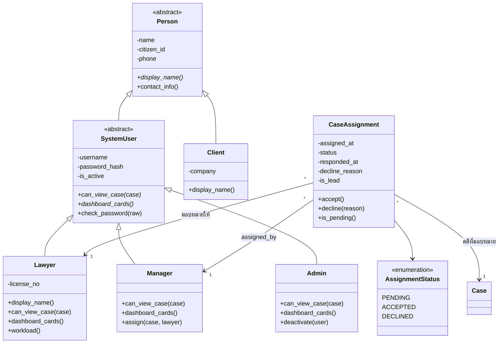
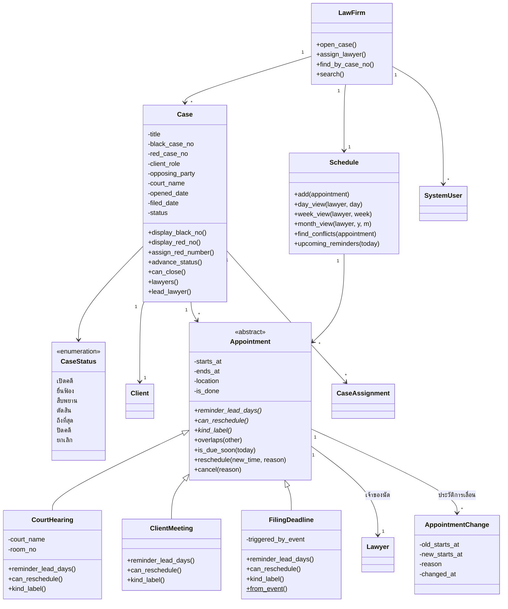
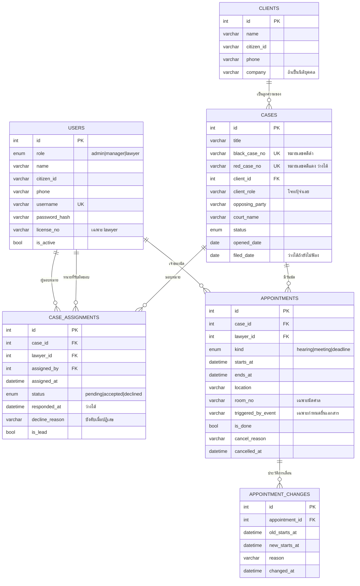

# ผังคลาสและผังฐานข้อมูล — ฉบับปัจจุบัน

นายเมทนี พูลสมบัติ 6821500060 · แก้ล่าสุด 30 สิงหาคม 2569

ขอบเขตตาม [`backlog.md`](backlog.md) — ไม่มีประเภทคดี ไม่มีชั่วโมงทำงานและค่าจ้าง
draw.io วางผัง mermaid ได้ที่ **Arrange → Insert → Advanced → Mermaid**

---

## 1. ผังคลาส — คน สิทธิ์ และการมอบหมาย



---

## 2. ผังคลาส — คดี นัดหมาย และตารางนัด



**จุดที่ใช้ polymorphism** — `Appointment` 3 ชนิดตอบ `reminder_lead_days()` และ `can_reschedule()` คนละแบบ · `SystemUser` 3 บทบาทตอบ `can_view_case()` และ `dashboard_cards()` คนละแบบ ทำให้ทั้งระบบตรวจสิทธิ์ที่จุดเดียวโดยไม่มี `if role ==`

---

## 3. ผังฐานข้อมูล — 6 ตาราง



```sql
CREATE UNIQUE INDEX idx_black ON cases(black_case_no);
CREATE UNIQUE INDEX idx_red   ON cases(red_case_no);
CREATE INDEX        idx_sched ON appointments(lawyer_id, starts_at);
CREATE UNIQUE INDEX idx_assign ON case_assignments(case_id, lawyer_id, status);
```

**หมายเหตุการออกแบบ**

- `users` รวมทั้งสามบทบาทไว้ตารางเดียว แยกด้วย `role` ชั้น Repository อ่านค่านี้แล้วสร้าง object ให้ตรงคลาส (`"lawyer"` → `Lawyer`)
- `appointments` ใช้ตารางเดียวเก็บนัดทั้งสามประเภท แยกด้วย `kind` เช่นเดียวกัน คอลัมน์ที่ใช้เฉพาะบางประเภทปล่อยว่างในประเภทที่ไม่ใช้
- `case_assignments` ไม่ใช่ตารางเชื่อมเปล่า มีข้อมูลของตัวเอง — สถานะการตอบรับ ผู้มอบหมาย เวลาที่ตอบ และเหตุผลที่ปฏิเสธ จึงยกขึ้นเป็นคลาส `CaseAssignment`
- `idx_assign` บังคับ BR-17 ที่ระดับฐานข้อมูล — มอบหมายคดีเดิมให้ทนายคนเดิมซ้ำในสถานะเดียวกันไม่ได้
- `idx_sched` รองรับคำถามที่ระบบถามบ่อยที่สุด คือ "ทนายคนนี้มีนัดอะไรช่วงเวลานี้บ้าง" ใช้ทั้งหน้าตารางประจำวันและการตรวจนัดชน

---

## 4. ตารางสำหรับกรอกชีต ER ของอาจารย์

รูปแบบ `Column Name | Data Type | Description | Key Type` ฉบับย่อ 3–5 แถวต่อตาราง

**Table: users**

| Column Name | Data Type | Description | Key Type |
|---|---|---|---|
| id | INT | รหัสผู้ใช้ | PK |
| role | ENUM('admin','manager','lawyer') | บทบาทในระบบ | |
| name | VARCHAR(120) | ชื่อ-นามสกุล | |
| username | VARCHAR(50) | ชื่อผู้ใช้สำหรับเข้าระบบ | UK |

**Table: clients**

| Column Name | Data Type | Description | Key Type |
|---|---|---|---|
| id | INT | รหัสลูกความ | PK |
| name | VARCHAR(120) | ชื่อ-นามสกุล | |
| phone | VARCHAR(20) | เบอร์ติดต่อ | |
| company | VARCHAR(150) | ชื่อบริษัท ถ้าเป็นนิติบุคคล | |

**Table: cases**

| Column Name | Data Type | Description | Key Type |
|---|---|---|---|
| id | INT | รหัสคดี | PK |
| black_case_no | VARCHAR(20) | หมายเลขคดีดำ | UK |
| client_id | INT | ลูกความเจ้าของคดี | FK → clients.id |
| status | ENUM('open','filed','trial','judged','closed') | สถานะปัจจุบันของคดี | |

**Table: case_assignments**

| Column Name | Data Type | Description | Key Type |
|---|---|---|---|
| id | INT | รหัสการมอบหมาย | PK |
| case_id | INT | คดีที่มอบหมาย | FK → cases.id |
| lawyer_id | INT | ทนายที่ได้รับมอบหมาย | FK → users.id |
| status | ENUM('pending','accepted','declined') | รอตอบรับ / ตอบรับ / ปฏิเสธ | |

**Table: appointments**

| Column Name | Data Type | Description | Key Type |
|---|---|---|---|
| id | INT | รหัสนัดหมาย | PK |
| case_id | INT | คดีที่นัดนี้สังกัด | FK → cases.id |
| lawyer_id | INT | ทนายเจ้าของนัด | FK → users.id |
| kind | ENUM('hearing','meeting','deadline') | ชนิดของนัด | |
| starts_at | DATETIME | วันเวลาที่นัด | |

**Table: appointment_changes**

| Column Name | Data Type | Description | Key Type |
|---|---|---|---|
| id | INT | รหัสรายการ | PK |
| appointment_id | INT | นัดที่ถูกเลื่อน | FK → appointments.id |
| new_starts_at | DATETIME | เวลาใหม่หลังเลื่อน | |
| reason | VARCHAR(255) | เหตุผลในการเลื่อน | |
